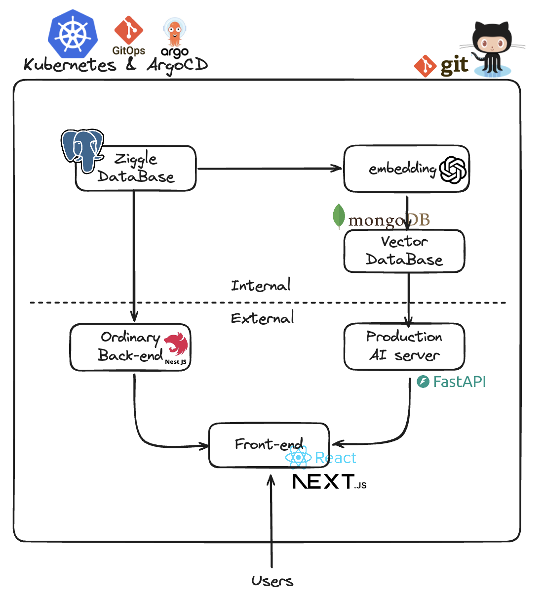
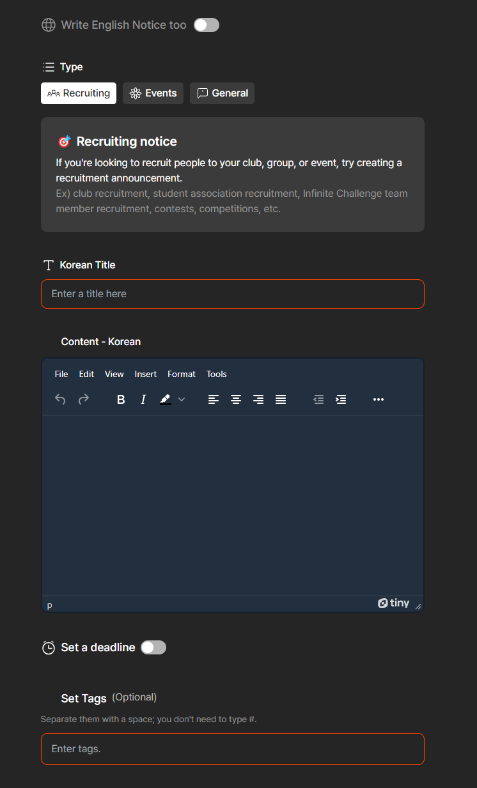
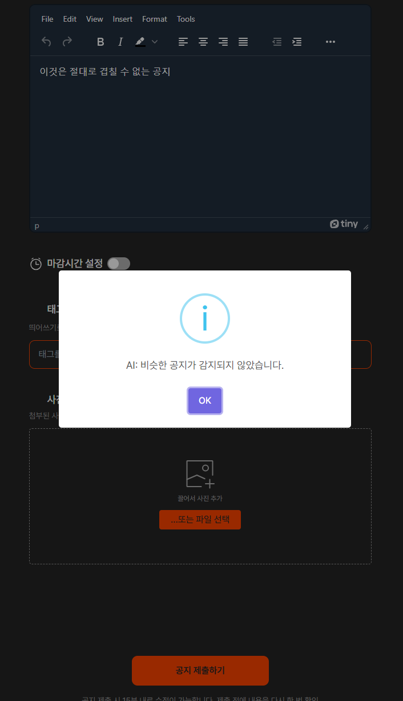
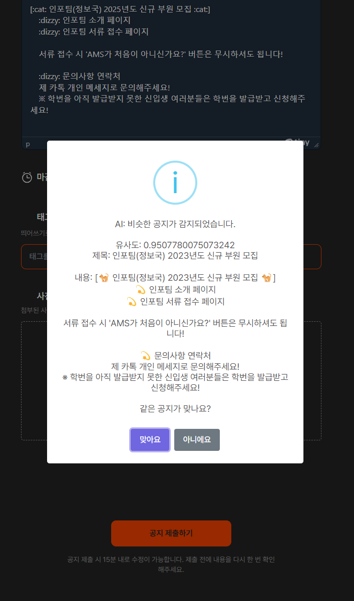
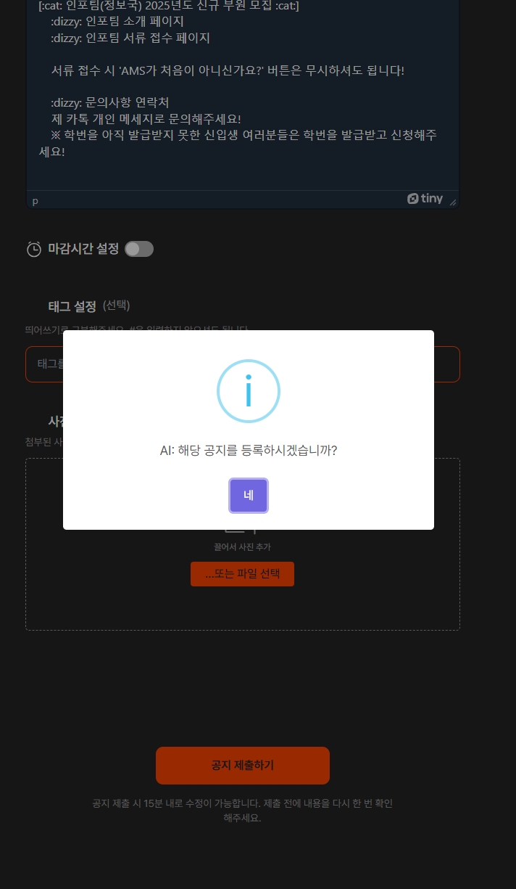
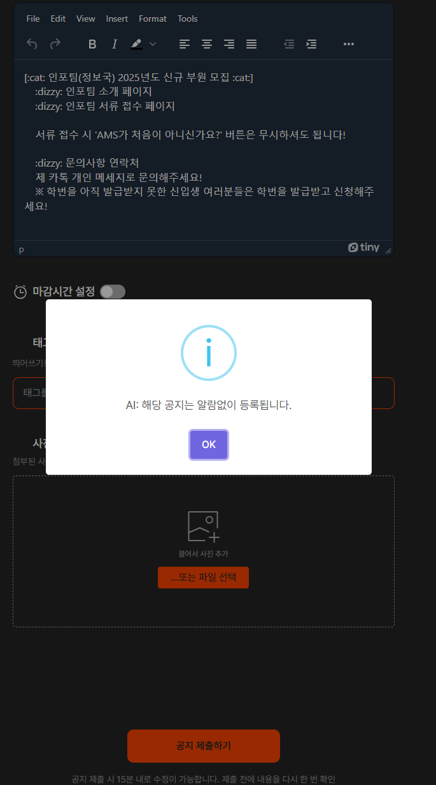
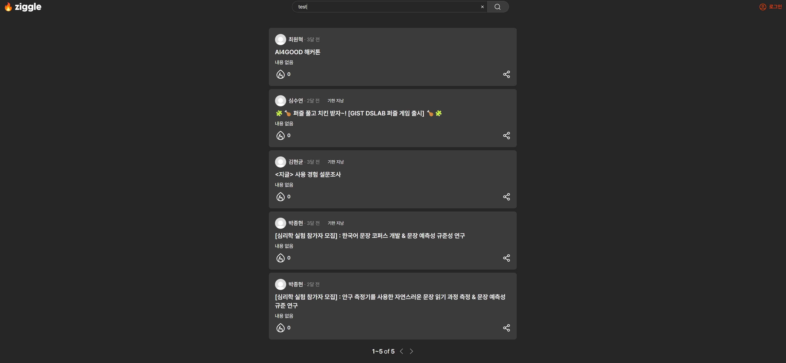

# We are (almost) 'Ziggle' development team! 🐱

> Team information

1. 김영목, AI 22
2. 이상유, EECS 19
3. 황인선, [Personal page](https://github.com/inthree3)
4. 박시원, [Personal page](https://github.com/siwonpada)
5. 조민준, [Personal page](https://github.com/minjunj)

# Ziggle ➡️ Better notification platform!

> Problem definition

### 1. Alarm Muting System

Most general **user dissatisfaction voice** were came from the duplicated alarms for certain notice.

`😠: "Be quiet! Why do you send me alarms several time for a same notice??"`

These dissatisfactions were because some notice writers delete and reupload their notices when they make a subtle mistake, rather than use our application editting functions.

### 2. Deadline Detection System

For user's comfort, we automatically crawl the GIST's undergraduate notices and upload them to our Ziggle app.

We have features to set deadline for each notices, but for the undergraduate notices it is impossible to register the deadlines.

Plus, since our platform is notification platform, the deadline information is really important. And this AI system could applied for other necessary purposes like checking for writing deadlines and so on .

# Ziggle AI: System Design

## 1. Data Pipelines

Our team operated the ziggle ai system by configuring a CD using GitOps method in Kubernetes. For the separation of the demo environment and efficient project progress, the Back-end server used the existing ziggle's, separated the DataBase for demo, and operated the Front-end for additional UI. In order to efficiently manage Production AI, the ai system implement by configuring a separate Python-based API server. The accumulated data while operating ziggle was embedded in the GPT API and stored in the Vector DB to construct an efficient AI system.

## 2. Modeling

### 1. Unsloth

We used Unsloth for finetuning the Llama 3 model to detect the deadline for given notices.

We chose this library because this is optimized for training Large Language Models(LLMs) with local computer's resource.

### 2. GPT API

GPT API is used for building fine tuning dataset.

Since, we applied the idea of **transfer learning** the GPT 4o gave us the root

### 3. Hugging Face

For managing the dataset and the (pre-trained) models, we used Hugging Face.

This helps to reduce the workloads for developing the model training pipeline.

### 4. will be updated

## 3. User Interface System

We basically forked the existing Ziggle frontend repository and edited for demoing and grasping the built AI features.

### 1. will be updated

# 4. Machine Learning component (300 words)
| document vector embedding, vector search, LLM

### 1. Document Similarity Search
> Embedding
1. Document embedding with GPT model
We used `text-embedding-3` model to get vector from a notification. If an article is bigger than the token limitation, we simply cut it into a embeddible length.

2. Chunk based embedding and similarity score. (Further task)

> Search
1. There are several similarity search machanisms. And the most popular three similarity formulas are euclidian, cosine similarity, and dot product. As the main target was to detect the almost same article, the ** dot product** which considers not only the direction but also the magnitude that proportionate to the text length was selected as the matrix for calculating the text similarity  

# 5. System evaluation (500 words)
> Several local base model, and compare their score and cost

# 6. Application demonstration (300 words)

We have an existing application, Ziggle, and we apply advanced features over Ziggle. We applied the alarm when the user wanted to notice that it was already uploaded, the enhanced search feature, which uses vector similarity, and the deadline auto-detecting feature.

## 1. Posting notices

After logging into our application with Infoteam IDP (you will need the gist email), go to the page to write the notice. Then you can find the UI below.

   
  The writing page in Ziggle.

With the UI above, you can write the notice's body and title. Complete the writing and push the "submit" button. Then, the machine learning feature will be active, checking whether the notice's body is already in the database.

If the notice's body is already in the database, our webpage alerts the user to prevent a conflict notice, and the notice will be uploaded correctly.

  <table cellpadding="0">
    <tr style="padding: 0"> 
      <td valign="top">
        

           
          If user write the notice which is not in the database.
        

      </td>
      <td valign="top">
        

           
          If user write the notice which is in the database.
        

      </td>
    </tr>
  </table>

Since this system can have malfunction, after checking conflict notice, it check users intention with showing the notice that similar to users' input. If user say it is not the similar notice, store the database as edgecase and upload notice with alarm. Else, upload notice without alarm.

  <table cellpadding="0">
    <tr style="padding: 0"> 
      <td valign="top">
        

           
          If user say it is not similar notice.
        

      </td>
      <td valign="top">
        

           
          If user say it is similar notice.
        

      </td>
    </tr>
  </table>

## 2. Searching notices

Since we use vector similarity with vector embedding tech, we can use it as searching. Therefore, we apply this in the searching UI which already exist. If you just write the keyword in the searching bar, the ML feature is activated, and find similar notice.

   
 the result of the searcing feature.

## 3. Detecting deadline

This feature detects the deadline of the notice that is crawled to the school's webpage. So, this feature cannot be found on our webpage, but it will be applied to the crawling feature in Ziggle. 

# 7. Reflection (400 words)

# 8. Broader Impacts (250 words)

In the process of adopting an AI model that detects duplicate notices in order to avoid duplicate notice notifications, there was an omission due to unintended use. For example, when comparing titles, "Data Engineering May Event" and "Data E1ngineering May Event" tended to be classified into completely different notices. To solve this problem, we adopt a similarity measuring system to show how similar the notice is to the existing notice, show existing notice that can be duplicated, and give the user a final choice, if correct, send a notice without a notice, and if not, send a notification.

 Since the AI system requires a GPU, if all elements of the ziggle are monolithically configured, the server tends to go down due to the load of the GPU as soon as the notice writer is crowded. Therefore, the load point is clearly separated by operating a separate server for the AI system and adopting a Micro Service Architecture (MSA) method that separates the ziggle FE and traditional BE servers. In addition, in order to efficiently operate and monitor each divided server,  we were chose Kubernetes and Gitops methods to automate distribution according to the user load and design to enable stable service operation.

# 9. References
