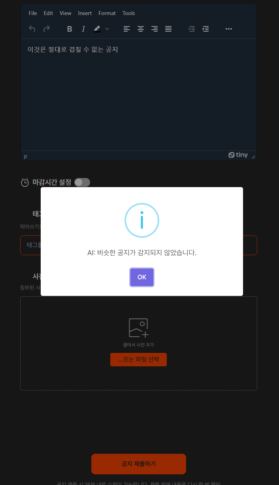
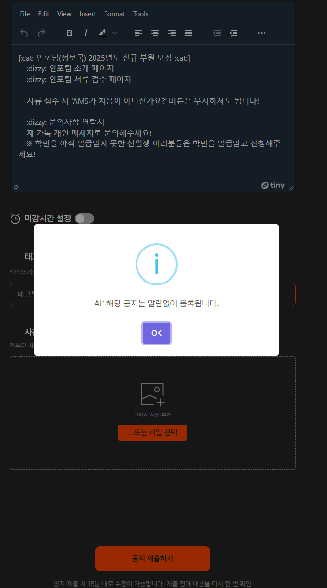

# We are (almost) 'Ziggle' development team! 🐱

> Team information

1. 김영목, AI 22
2. 이상유, EECS 19
3. 황인선, [Personal page](https://github.com/inthree3)
4. 박시원, [Personal page](https://github.com/siwonpada)
5. 조민준, [Personal page](https://github.com/minjunj)

# Ziggle ➡️ Better notification platform!

> Problem definition

### 1. Alarm Muting System

Most general **user dissatisfaction voice** were came from the duplicated alarms for certain notice.

`😠: "Be quiet! Why do you send me alarms several time for a same notice??"`

These dissatisfactions were because some notice writers delete and reupload their notices when they make a subtle mistake, rather than use our application editting functions.

### 2. Deadline Detection System

For user's comfort, we automatically crawl the GIST's undergraduate notices and upload them to our Ziggle app.

We have features to set deadline for each notices, but for the undergraduate notices it is impossible to register the deadlines.

Plus, since our platform is notification platform, the deadline information is really important. And this AI system could applied for other necessary purposes like checking for writing deadlines and so on .

# System Design

  

## 1. Data Pipelines

Our team operated the ziggle ai system by configuring a CD using GitOps method in Kubernetes. For the separation of the demo environment and efficient project progress, the Back-end server used the existing ziggle's, separated the DataBase for demo, and operated the Front-end for additional UI. In order to efficiently manage Production AI, the ai system implement by configuring a separate Python-based API server. The accumulated data while operating ziggle was embedded in the GPT API and stored in the Vector DB to construct an efficient AI system.

## 2. Modeling (will be edited)

### 1. Unsloth

We used Unsloth for finetuning the Llama 3 model to detect the deadline for given notices.

We chose this library because this is optimized for training Large Language Models(LLMs) with local computer's resource.

### 2. GPT API

GPT API is used for building fine tuning dataset.

Since, we applied the idea of **transfer learning** the GPT 4o gave us the root

### 3. Hugging Face

For managing the dataset and the (pre-trained) models, we used Hugging Face.

This helps to reduce the workloads for developing the model training pipeline.

## 3. User Interface System

We basically forked the existing Ziggle frontend repository and edited for demoing and grasping the built AI features.

## 4. Deployment

### 1. Frontend

Since frontend deployment is forked Ziggle frontend, our frontend follows the tech stack of Ziggle frontend, so we use the Nextjs framework for developing frontend applications. It is responsible for showing UI and using the backend's API. Finally, To deploy the application, we used a docker container.

### 2. Backend

The backend application in this project uses the Fastapi framework, MongoDB, and Openai library. It is responsible only for AI features. This application does not impliment the API for the ordinary feature, and it does not perform machine learning, so it does not use GPU resources. Therefore, it uses the docker container without GPU resources.

### 3. Infrastructure

In order not to affect existing services, a Kubernetes cluster was configured in the On-Premise environment. A separate ziggle namespace was created to distribute the front-end and AI's Kubernetes deployment and expose it to the outside through a service component.

All distributions were centered on Github's organization, and a repository for each part was created and managed. In addition, a CD was built through Github activities. ArgoCD is adopted for continuous delivery and verification of the status of each service while managing all codes through Github. If any changes occur in each repository, the Github action bot changes the contents of the infra repository.

ArgoCD monitors the infra Repository, automatically creating a new pod when a change occurs in that repository, and implements Continuous Delivery by deleting the existing pod.

# Machine Learning component (300 words)

## 1. Document Similarity Based Features

### 1. Document embedding with GPT model
We used `text-embedding-3` model to get vector from a notification. If an article is bigger than the token limitation, we simply cut it into a embeddible length.

### 2. Chunk based embedding and similarity score. (Further task)

There are several similarity search machanisms. And the most popular three similarity formulas are euclidian, cosine similarity, and dot product. As the main target was to detect the almost same article, the ** dot product** which considers not only the direction but also the magnitude that proportionate to the text length was selected as the matrix for calculating the text similarity

## 2. Deadline Detection
We first plan to use the GPT API for the deadline detection feature. But during our development period, [GPT was one down](https://www.merca20.com/yes-chatgpt-is-down-today-why-is-it-not-working/). To retain the credibility for our service, we determine to prepare another detection system. Then, we are now serving our own fine-tuned local model.

> Data Preparation

We aimed to conduct transfer learning with pre-trained large language models. Since there is no training dataset of which the goal is to extract the deadline information from a given document, we prepared the training dataset by inferencing the deadline with our Ziggle's document data.

> Select a Training library

Since the lack of resource for serving and funds, we need to reduce the cost for serving and adjusting our model. Fine-tuning model on colab became possible with [Unsloth](https://unsloth.ai/) library. 

- QLoRA: efficient finetuning of Quantized LLMs
  To train fastly while maintaining the task performance, we adapted the parameter efficient finetuning. Especially, QLoRA which is quantized version of LoRA was used. By this method, the speed of the training was enhanced.
  
- Llama-3
  Among lots of large language models, we choosed to use Llama-3.

# System evaluation (500 words)
> Several local base model, and compare their score and cost

# Application demonstration (300 words)
> Application link: [Ziggle AI ↗️](http://210.125.85.31:32442/ko/home?page=0)

We have an existing application, Ziggle, and we apply advanced features over Ziggle. We applied the alarm when the user wanted to notice that it was already uploaded, the enhanced search feature, which uses vector similarity, and the deadline auto-detecting feature.

## 1. Posting notices

After logging into our application with Infoteam IDP (you will need the gist email), go to the page to write the notice. Then you can find the UI below.

   
  The writing page in Ziggle.

With the UI above, you can write the notice's body and title. Complete the writing and push the "submit" button. Then, the machine learning feature will be active, checking whether the notice's body is already in the database.

If the notice's body is already in the database, our webpage alerts the user to prevent a conflict notice, and the notice will be uploaded correctly.

  <table cellpadding="0">
    <tr style="padding: 0"> 
      <td valign="top">
        

           
          If user write the notice which is not in the database.
        

      </td>
      <td valign="top">
        

           
          If user write the notice which is in the database.
        

      </td>
    </tr>
  </table>

Since this system can have malfunction, after checking conflict notice, it check users intention with showing the notice that similar to users' input. If user say it is not the similar notice, store the database as edgecase and upload notice with alarm. Else, upload notice without alarm.

  <table cellpadding="0">
    <tr style="padding: 0"> 
      <td valign="top">
        

           
          If user say it is not similar notice.
        

      </td>
      <td valign="top">
        

           
          If user say it is similar notice.
        

      </td>
    </tr>
  </table>

## 2. Searching notices

Since we use vector similarity with vector embedding tech, we can use it as searching. Therefore, we apply this in the searching UI which already exist. If you just write the keyword in the searching bar, the ML feature is activated, and find similar notice.

   
 the result of the searcing feature.

## 3. Detecting deadline

This feature detects the deadline of the notice that is crawled to the school's webpage. So, this feature cannot be found on our webpage, but it will be applied to the crawling feature in Ziggle. 

# Reflection (400 words)

## 1. What we worked

Our purpose is to reduce the notice alarm that comes from similar notices. To solve this problem, we need the technology that obtains the similarity among the notices in our database. We used the `text-embedding-3` model of OPENAI to get a vector from a notice. Additionally, we used MongoDB's vector storing feature to store the vector that comes from the text-embedding model. After storing vector data, Using users' input and MongoDB's vector searching feature, we provide the result of whether similar notices exist and the list of similar notices. As a result, using text-embedding and vector search technology, we alert the user that a similar notice already exists in the database through the existing ziggle UI. Furthermore, we implemented the search feature with vector searching technology.

Our other purpose is to attach the deadline information to the academic notice crawled on the school's webpage. To solve this problem, we need to find or detect the deadline from the notice on the school's webpage. We used Lama-3 and trained it. However, it is for crawling data and is not shown in the Ziggle UI.

## 2. Weakness

We used the text-embedding model, but we did not use chunking when using the text-embedding model. 

Since this is a demo application, its database is not directly reflected in the production database. Our production database is also Postgresql, which is completely different from MongoDB. It must deploy two databases if we run it at the production level. Therefore, to reduce the complexity of the operation, we need to reduce the type of database.

## 3. further work

To address the weakness we discussed, we developed a method that uses chunking technology and reduces the database's type. We will use Postgresql's vector database feature. 

The final purpose of our team is to apply this AI feature to the production server and frontend UI. We need the server that deploys the LLM to use the AI feature, so we need to find the resources to calculate the LLM cheaply.

# Broader Impacts (250 words)

In the process of adopting an AI model that detects duplicate notices in order to avoid duplicate notice notifications, there was an omission due to unintended use. For example, when comparing titles, "Data Engineering May Event" and "Data E1ngineering May Event" tended to be classified into completely different notices. To solve this problem, we adopt a similarity measuring system to show how similar the notice is to the existing notice, show existing notice that can be duplicated, and give the user a final choice, if correct, send a notice without a notice, and if not, send a notification.

 Since the AI system requires a GPU, if all elements of the ziggle are monolithically configured, the server tends to go down due to the load of the GPU as soon as the notice writer is crowded. Therefore, the load point is clearly separated by operating a separate server for the AI system and adopting a Micro Service Architecture (MSA) method that separates the ziggle FE and traditional BE servers. In addition, in order to efficiently operate and monitor each divided server,  we were chose Kubernetes and Gitops methods to automate distribution according to the user load and design to enable stable service operation.

# 9. References
